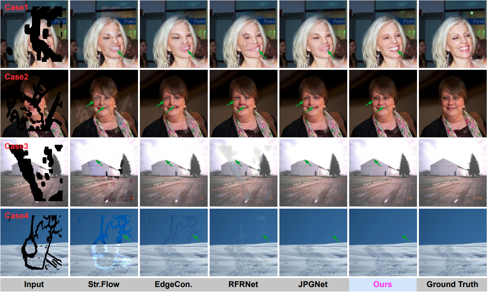

# MISF:Multi-level Interactive Siamese Filtering for High-Fidelity Image Inpainting
[ArXiv]()
We proposed a novel approach for high-fidelity image inpainting. Specifically, we use a single predictive network to conduct predictive filtering at the image level and deep feature level, simultaneously. The image-level filtering is to recover details, while the deep feature-level filtering is to complete semantic information, which leads to high-fidelity inpainting results. Our method outperforms state-of-the-art methods on three public datasets. 


## Dataset

- [Places2 Data of Places365-Standard](http://places2.csail.mit.edu/download.html)
- [CelebA](https://mmlab.ie.cuhk.edu.hk/projects/CelebA.html)
- [Dunhuang]
- [Mask](https://nv-adlr.github.io/publication/partialconv-inpainting)

1. For data folder path (CelebA) organize them as following:

```shell
--CelebA
   --train
      --1-1.png
   --valid
      --1-1.png
   --test
      --1-1.png
   --mask-train
	  --1-1.png
   --mask-valid
      --1-1.png
   --mask-test
      --0%-20%
        --1-1.png
      --20%-40%
        --1-1.png
      --40%-60%
        --1-1.png
 ```

 2. Run the code  `./data/data_list.py` to generate the data list


## Pretrained models

[CelebA](https://drive.google.com/)

[Places2](https://drive.google.com/)

[Dunhuang](https://drive.google.com/)

## Train

python train.py
<br>
For the parameters: checkpoints/config.yml, kpn/config.py

## Test

python test.py
<br>
For the parameters: checkpoints/config.yml, kpn/config.py

## Results

- Comparsion with SOTA, see paper for details.




**More details are coming soon**

## Bibtex

[//]: # (```)

[//]: # (@article{guo2021jpgnet,)

[//]: # (  title={JPGNet: Joint Predictive Filtering and Generative Network for Image Inpainting},)

[//]: # (  author={Guo, Qing and Li, Xiaoguang and Juefei-Xu, Felix and Yu, Hongkai and Liu, Yang and others},)

[//]: # (  journal={ACM-MM},)

[//]: # (  year={2021})

[//]: # (})

[//]: # (```)

## Acknowledgments
Parts of this code were derived from:<br>
https://github.com/tsingqguo/efficientderain <br>
https://github.com/knazeri/edge-connect
